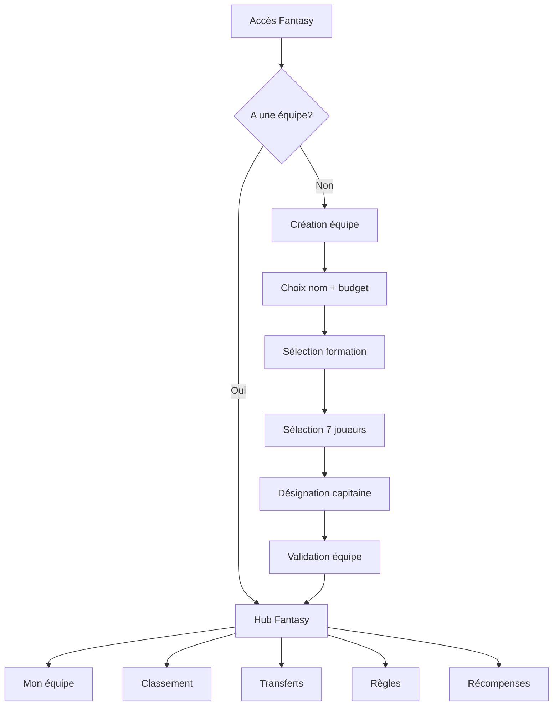

# Design Document - Mode Fantasy ComeBac League

## Overview

Le Mode Fantasy est une fonctionnalité complète permettant aux utilisateurs de créer et gérer une équipe virtuelle composée de joueurs réels du championnat. Le système calcule automatiquement les points basés sur les performances réelles et maintient un classement global.

**Objectifs principaux :**
- Engagement utilisateur accru via la gamification
- Utilisation des données réelles existantes (joueurs, matchs, stats)
- Expérience fluide et cohérente avec le reste de l'application
- Système de récompenses et notifications pour fidéliser

## Architecture

### Structure globale

```
app/
  public/
    fantasy/
      page.tsx                    # Hub Fantasy (dashboard)
      create/page.tsx             # Création équipe
      squad/page.tsx              # Sélection joueurs
      my-team/page.tsx            # Mon équipe
      leaderboard/page.tsx        # Classement
      rules/page.tsx              # Règles
      player/[id]/page.tsx        # Profil joueur Fantasy
      transfers/page.tsx          # Transferts
      rewards/page.tsx            # Récompenses

components/
  fantasy/
    player-card.tsx               # Carte joueur
    squad-builder.tsx             # Constructeur d'équipe
    formation-selector.tsx        # Sélecteur de formation
    pitch-view.tsx                # Vue terrain
    points-calculator.tsx         # Calculateur de points
    transfer-panel.tsx            # Panneau transferts
    leaderboard-table.tsx         # Tableau classement
    badge-display.tsx             # Affichage badges
    
lib/
  fantasy/
    points-system.ts              # Système de points
    player-pricing.ts             # Calcul prix joueurs
    validation.ts                 # Validations équipe
    notifications.ts              # Notifications Fantasy
    badges.ts                     # Système de badges
```


### Flux utilisateur



## Data Models

### FantasyTeam (Collection: fantasy_teams)

```typescript
interface FantasyTeam {
  id: string
  userId: string
  teamName: string
  budget: number              // 100M€ initial
  budgetRemaining: number
  formation: Formation        // "4-2-0", "3-3-0", etc. (1 GK + 6 joueurs)
  players: FantasyPlayer[]    // 7 joueurs
  captainId: string
  totalPoints: number
  gameweekPoints: number
  rank: number
  weeklyRank: number
  transfers: number           // Transferts gratuits restants
  wildcardUsed: boolean
  badges: string[]
  createdAt: Timestamp
  updatedAt: Timestamp
}
```


### FantasyPlayer (Embedded in FantasyTeam)

```typescript
interface FantasyPlayer {
  playerId: string            // Référence au joueur réel
  position: Position          // "GK", "DEF", "MID", "ATT"
  price: number               // Prix au moment de l'achat
  points: number              // Points cumulés
  gameweekPoints: number      // Points de la semaine
  isCaptain: boolean
}
```

### PlayerFantasyStats (Collection: player_fantasy_stats)

```typescript
interface PlayerFantasyStats {
  playerId: string
  price: number               // Prix actuel
  totalPoints: number
  gameweekPoints: number
  popularity: number          // % d'équipes qui l'ont
  form: number[]              // Points des 5 derniers matchs
  priceChange: number         // Variation de prix
  selectedBy: number          // Nombre d'équipes
  updatedAt: Timestamp
}
```

### GameweekHistory (Collection: fantasy_gameweek_history)

```typescript
interface GameweekHistory {
  id: string
  teamId: string
  gameweek: number
  points: number
  rank: number
  transfers: number
  pointsDeducted: number      // Pénalités transferts
  players: {
    playerId: string
    points: number
    isCaptain: boolean
  }[]
  createdAt: Timestamp
}
```


### FantasyBadge (Collection: fantasy_badges)

```typescript
interface FantasyBadge {
  id: string
  userId: string
  badgeType: BadgeType
  earnedAt: Timestamp
  gameweek?: number
  metadata?: {
    points?: number
    rank?: number
  }
}

type BadgeType = 
  | "top_10_week"
  | "podium"
  | "century"
  | "wildcard_master"
  | "perfect_captain"
  | "champion"
  | "winning_streak"
```

### FantasyNotification (Extends existing notifications)

```typescript
interface FantasyNotification {
  type: "fantasy_update"
  subType: 
    | "points_earned"
    | "captain_scored"
    | "badge_earned"
    | "rank_improved"
    | "player_performance"
    | "transfer_deadline"
    | "player_alert"
  fantasyTeamId: string
  metadata: {
    points?: number
    badgeType?: string
    newRank?: number
    playerId?: string
    playerName?: string
  }
}
```

## Components and Interfaces

### 1. Fantasy Hub (Dashboard)


**Page:** `/public/fantasy/page.tsx`

**Composants:**
- Header avec nom d'équipe, points totaux, rang
- Carte "Mon Équipe" (aperçu rapide)
- Carte "Classement" (top 5 + position utilisateur)
- Carte "Prochaine Deadline"
- Carte "Meilleur joueur de la semaine"
- Liens rapides vers toutes les sections

**État:**
```typescript
const [fantasyTeam, setFantasyTeam] = useState<FantasyTeam | null>(null)
const [loading, setLoading] = useState(true)
const [gameweekInfo, setGameweekInfo] = useState<GameweekInfo>()
```

### 2. Création d'équipe

**Page:** `/public/fantasy/create/page.tsx`

**Flow:**
1. Formulaire nom d'équipe (validation 3-30 caractères)
2. Affichage budget (100M€)
3. Redirection vers sélection de joueurs

**Composant:** `<TeamCreationForm />`

### 3. Sélection de joueurs (Squad Builder)

**Page:** `/public/fantasy/squad/page.tsx`

**Composants:**
- `<FormationSelector />` - Choix de formation
- `<PlayerList />` - Liste joueurs filtrée par poste
- `<SquadBuilder />` - Vue terrain avec emplacements
- `<BudgetTracker />` - Suivi budget
- `<ValidationPanel />` - Validation et erreurs

**État:**
```typescript
const [formation, setFormation] = useState<Formation>("4-2-0")
const [selectedPlayers, setSelectedPlayers] = useState<FantasyPlayer[]>([])
const [availablePlayers, setAvailablePlayers] = useState<Player[]>([])
const [budgetRemaining, setBudgetRemaining] = useState(100)
const [errors, setErrors] = useState<string[]>([])
```


**Validations:**
```typescript
// lib/fantasy/validation.ts
export function validateSquad(players: FantasyPlayer[], formation: Formation): ValidationResult {
  const errors: string[] = []
  
  // Vérifier nombre de joueurs
  if (players.length !== 7) {
    errors.push("Vous devez sélectionner exactement 7 joueurs")
  }
  
  // Vérifier formation
  const positions = countPositions(players)
  const required = getFormationRequirements(formation)
  if (!matchesFormation(positions, required)) {
    errors.push("La composition ne correspond pas à la formation")
  }
  
  // Vérifier limite par équipe
  const teamCounts = countByTeam(players)
  if (Object.values(teamCounts).some(count => count > 3)) {
    errors.push("Maximum 3 joueurs d'une même équipe")
  }
  
  return { valid: errors.length === 0, errors }
}
```

### 4. Mon Équipe

**Page:** `/public/fantasy/my-team/page.tsx`

**Sections:**
- Vue terrain avec joueurs et points
- Indication capitaine (brassard + x2)
- Points totaux et de la semaine
- Onglet "Historique" avec graphique
- Bouton "Transferts"

**Composants:**
- `<PitchView />` - Terrain avec joueurs
- `<PlayerCard />` - Carte joueur avec points
- `<PointsHistory />` - Graphique historique
- `<GameweekBreakdown />` - Détail par journée

### 5. Profil Joueur Fantasy

**Page:** `/public/fantasy/player/[id]/page.tsx`

**Sections:**
- Photo et infos de base (nom, école, équipe, poste)
- Prix Fantasy actuel
- Points totaux et de la semaine
- Popularité (% sélection)
- Statistiques réelles (buts, passes, clean sheets)
- Forme (graphique 5 derniers matchs)
- Évolution du prix
- Bouton "Ajouter à mon équipe" / "Retirer"


### 6. Transferts

**Page:** `/public/fantasy/transfers/page.tsx`

**Fonctionnalités:**
- Affichage équipe actuelle
- Sélection joueur à remplacer
- Liste joueurs disponibles (même poste)
- Vérification budget
- Compteur transferts gratuits (2/semaine)
- Avertissement pénalité (-4 points)
- Bouton Wildcard (si disponible)

**Composant:** `<TransferPanel />`

**État:**
```typescript
const [transfersRemaining, setTransfersRemaining] = useState(2)
const [playerOut, setPlayerOut] = useState<FantasyPlayer | null>(null)
const [playerIn, setPlayerIn] = useState<Player | null>(null)
const [wildcardActive, setWildcardActive] = useState(false)
```

### 7. Classement

**Page:** `/public/fantasy/leaderboard/page.tsx`

**Onglets:**
- Classement général (points totaux)
- Classement de la semaine (points gameweek)

**Composant:** `<LeaderboardTable />`

**Colonnes:**
- Rang
- Nom d'équipe
- Utilisateur
- Points totaux
- Points semaine
- Badges (icônes)

**Fonctionnalités:**
- Recherche par nom
- Pagination (50 par page)
- Highlight équipe utilisateur
- Filtres (top 10, top 100, etc.)

### 8. Règles

**Page:** `/public/fantasy/rules/page.tsx`

**Sections:**
- Introduction au Fantasy
- Budget et formation
- Grille de points (tableau)
- Système de transferts
- Wildcard
- Badges et récompenses
- FAQ


**Grille de points:**

| Action | Gardien | Défenseur | Milieu | Attaquant |
|--------|---------|-----------|--------|-----------|
| Match joué (60+ min) | +2 | +2 | +2 | +2 |
| Match joué (<60 min) | +1 | +1 | +1 | +1 |
| But marqué | +10 | +6 | +5 | +4 |
| Passe décisive | +3 | +3 | +3 | +3 |
| Clean sheet | +4 | +4 | +1 | - |
| 2 buts encaissés | -1 | - | - | - |
| Victoire équipe | +2 | +2 | +2 | +2 |
| Match nul | +1 | +1 | +1 | +1 |
| Carton jaune | -1 | -1 | -1 | -1 |
| Carton rouge | -3 | -3 | -3 | -3 |
| Penalty arrêté | +5 | - | - | - |
| Penalty manqué | -2 | -2 | -2 | -2 |

### 9. Récompenses

**Page:** `/public/fantasy/rewards/page.tsx`

**Sections:**
- Mes badges (gagnés)
- Badges disponibles (à débloquer)
- Progression vers badges
- Historique des récompenses

**Composant:** `<BadgeDisplay />`

**Badges:**
```typescript
const FANTASY_BADGES = {
  top_10_week: {
    name: "Top 10 de la semaine",
    description: "Terminer dans le top 10 d'une gameweek",
    icon: "🏆",
    color: "gold"
  },
  podium: {
    name: "Podium",
    description: "Terminer dans le top 3 du classement général",
    icon: "🥇",
    color: "gold"
  },
  century: {
    name: "Century",
    description: "Marquer 100+ points en une gameweek",
    icon: "💯",
    color: "purple"
  },
  // ... autres badges
}
```


## Système de points

### Calcul automatique après match

```typescript
// lib/fantasy/points-system.ts

export async function calculatePlayerPoints(
  playerId: string,
  matchId: string,
  matchStats: MatchStats
): Promise<number> {
  const player = await getPlayer(playerId)
  const position = player.position
  let points = 0
  
  // Minutes jouées
  if (matchStats.minutesPlayed >= 60) {
    points += 2
  } else if (matchStats.minutesPlayed > 0) {
    points += 1
  }
  
  // Buts
  if (matchStats.goals > 0) {
    const goalPoints = {
      'Gardien': 10,
      'Défenseur': 6,
      'Milieu': 5,
      'Attaquant': 4
    }
    points += matchStats.goals * goalPoints[position]
  }
  
  // Passes décisives
  points += matchStats.assists * 3
  
  // Clean sheet (GK et DEF)
  if (['Gardien', 'Défenseur'].includes(position) && matchStats.cleanSheet) {
    points += 4
  }
  
  // Résultat équipe
  if (matchStats.teamWon) {
    points += 2
  } else if (matchStats.teamDraw) {
    points += 1
  }
  
  // Cartons
  points -= matchStats.yellowCards * 1
  points -= matchStats.redCards * 3
  
  // Buts encaissés (GK)
  if (position === 'Gardien' && matchStats.goalsConceded >= 2) {
    points -= 1
  }
  
  // Penalty
  if (matchStats.penaltySaved) points += 5
  if (matchStats.penaltyMissed) points -= 2
  
  return points
}
```


### Mise à jour des équipes Fantasy

```typescript
// lib/fantasy/update-teams.ts

export async function updateFantasyTeamsAfterMatch(matchId: string) {
  // 1. Récupérer les stats du match
  const matchStats = await getMatchStats(matchId)
  
  // 2. Calculer les points de chaque joueur
  const playerPoints = new Map<string, number>()
  for (const playerId of matchStats.playerIds) {
    const points = await calculatePlayerPoints(playerId, matchId, matchStats)
    playerPoints.set(playerId, points)
  }
  
  // 3. Mettre à jour toutes les équipes Fantasy concernées
  const teams = await getFantasyTeamsWithPlayers(Array.from(playerPoints.keys()))
  
  for (const team of teams) {
    let gameweekPoints = 0
    
    for (const player of team.players) {
      const points = playerPoints.get(player.playerId) || 0
      const finalPoints = player.isCaptain ? points * 2 : points
      
      player.gameweekPoints += finalPoints
      player.points += finalPoints
      gameweekPoints += finalPoints
    }
    
    team.gameweekPoints += gameweekPoints
    team.totalPoints += gameweekPoints
    
    await updateFantasyTeam(team)
    
    // Envoyer notification
    await sendFantasyNotification(team.userId, {
      type: 'points_earned',
      points: gameweekPoints
    })
  }
  
  // 4. Mettre à jour le classement
  await updateLeaderboard()
}
```

## Système de prix des joueurs

```typescript
// lib/fantasy/player-pricing.ts

export function calculateInitialPrice(player: Player): number {
  const basePrice = {
    'Gardien': 4.5,
    'Défenseur': 5.0,
    'Milieu': 6.0,
    'Attaquant': 7.0
  }
  
  let price = basePrice[player.position]
  
  // Ajustements basés sur les stats
  price += (player.goals || 0) * 0.5
  price += (player.assists || 0) * 0.3
  price += (player.cleanSheets || 0) * 0.2
  
  return Math.min(Math.max(price, 4.0), 15.0)
}
```


```typescript
export async function updatePlayerPrices() {
  const players = await getAllPlayers()
  
  for (const player of players) {
    const stats = await getPlayerFantasyStats(player.id)
    const recentForm = stats.form.slice(-5)
    const avgPoints = recentForm.reduce((a, b) => a + b, 0) / 5
    
    let priceChange = 0
    
    // Augmenter si bonne forme
    if (avgPoints > 8) {
      priceChange = 0.3
    } else if (avgPoints > 6) {
      priceChange = 0.2
    } else if (avgPoints > 4) {
      priceChange = 0.1
    }
    // Diminuer si mauvaise forme
    else if (avgPoints < 2) {
      priceChange = -0.3
    } else if (avgPoints < 3) {
      priceChange = -0.2
    }
    
    // Limiter à ±0.5M par gameweek
    priceChange = Math.max(-0.5, Math.min(0.5, priceChange))
    
    stats.price += priceChange
    stats.priceChange = priceChange
    
    await updatePlayerFantasyStats(player.id, stats)
  }
}
```

## Système de badges

```typescript
// lib/fantasy/badges.ts

export async function checkAndAwardBadges(
  userId: string,
  teamId: string,
  gameweek: number
) {
  const team = await getFantasyTeam(teamId)
  const badges: string[] = []
  
  // Top 10 de la semaine
  if (team.weeklyRank <= 10) {
    badges.push('top_10_week')
  }
  
  // Podium
  if (team.rank <= 3) {
    badges.push('podium')
  }
  
  // Century
  if (team.gameweekPoints >= 100) {
    badges.push('century')
  }
  
  // Captain parfait
  const captain = team.players.find(p => p.isCaptain)
  if (captain && captain.gameweekPoints >= 20) {
    badges.push('perfect_captain')
  }
  
  // Champion
  if (team.rank === 1 && isSeasonEnd()) {
    badges.push('champion')
  }
  
  // Série gagnante
  const history = await getGameweekHistory(teamId, 5)
  if (history.every(h => h.rank === 1)) {
    badges.push('winning_streak')
  }
  
  // Enregistrer les nouveaux badges
  for (const badgeType of badges) {
    const exists = await hasBadge(userId, badgeType)
    if (!exists) {
      await awardBadge(userId, badgeType, gameweek)
      await sendBadgeNotification(userId, badgeType)
    }
  }
}
```


## Système de notifications

```typescript
// lib/fantasy/notifications.ts

export async function sendFantasyNotification(
  userId: string,
  notification: FantasyNotificationData
) {
  const notificationsRef = collection(db, 'notifications')
  
  const messages = {
    points_earned: `⚽ Votre équipe a marqué ${notification.points} points !`,
    captain_scored: `👑 Votre capitaine a marqué ${notification.points} points (x2) !`,
    badge_earned: `🏆 Nouveau badge débloqué : ${notification.badgeType}`,
    rank_improved: `📈 Vous êtes maintenant ${notification.newRank}ème !`,
    player_performance: `⭐ ${notification.playerName} a marqué ${notification.points} points !`,
    transfer_deadline: `⏰ Deadline de transferts dans 24h`,
    player_alert: `⚠️ ${notification.playerName} est blessé/suspendu`
  }
  
  await addDoc(notificationsRef, {
    userId,
    type: 'fantasy_update',
    subType: notification.type,
    title: 'Fantasy ComeBac',
    message: messages[notification.type],
    link: `/public/fantasy/my-team`,
    read: false,
    metadata: notification.metadata,
    createdAt: serverTimestamp()
  })
}
```

## Navigation et intégration

### Ajout dans la navigation principale

**Fichier:** `components/sofa/navigation.tsx` et `components/sofa/bottom-navigation.tsx`

```typescript
// Ajouter l'onglet Fantasy
const navItems = [
  { name: 'Accueil', href: '/public', icon: Home },
  { name: 'Équipes', href: '/public/teams', icon: Users },
  { name: 'Classement', href: '/public/ranking', icon: Trophy },
  { name: 'Fantasy', href: '/public/fantasy', icon: Sparkles }, // NOUVEAU
  { name: 'Favoris', href: '/public/favorites', icon: Star },
]
```

### Style cohérent

Utiliser les classes Tailwind existantes :
- `sofa-card` pour les cartes
- `sofa-text-primary`, `sofa-text-secondary` pour les textes
- `sofa-bg-primary`, `sofa-bg-secondary` pour les fonds
- `sofa-green` pour les accents
- Même header et sidebar que le reste de l'app


## Error Handling

### Gestion des erreurs

```typescript
// Erreurs de validation
export class FantasyValidationError extends Error {
  constructor(public errors: string[]) {
    super('Validation failed')
  }
}

// Erreurs de budget
export class InsufficientBudgetError extends Error {
  constructor(public required: number, public available: number) {
    super(`Budget insuffisant: ${required}M€ requis, ${available}M€ disponible`)
  }
}

// Erreurs de deadline
export class TransferDeadlineError extends Error {
  constructor() {
    super('Les transferts sont fermés pendant la gameweek')
  }
}
```

### Affichage des erreurs

```typescript
// Composant ErrorDisplay
export function ErrorDisplay({ errors }: { errors: string[] }) {
  if (errors.length === 0) return null
  
  return (
    <div className="bg-red-50 border border-red-200 rounded-lg p-4">
      <h3 className="text-red-800 font-semibold mb-2">
        ⚠️ Erreurs de validation
      </h3>
      <ul className="list-disc list-inside text-red-700 text-sm space-y-1">
        {errors.map((error, i) => (
          <li key={i}>{error}</li>
        ))}
      </ul>
    </div>
  )
}
```

## Testing Strategy

### Tests unitaires

```typescript
// lib/fantasy/__tests__/points-system.test.ts
describe('Points System', () => {
  it('should calculate correct points for a goal', () => {
    const points = calculatePlayerPoints('player1', 'match1', {
      goals: 1,
      position: 'Attaquant',
      minutesPlayed: 90
    })
    expect(points).toBe(6) // 2 (played) + 4 (goal)
  })
  
  it('should double captain points', () => {
    const team = createMockTeam()
    const captain = team.players.find(p => p.isCaptain)
    expect(captain.points).toBe(20) // 10 * 2
  })
})
```


### Tests d'intégration

```typescript
// app/public/fantasy/__tests__/squad-builder.test.tsx
describe('Squad Builder', () => {
  it('should prevent selecting more than 3 players from same team', () => {
    render(<SquadBuilder />)
    
    // Sélectionner 3 joueurs de Road To Glory
    selectPlayer('player1') // RTG
    selectPlayer('player2') // RTG
    selectPlayer('player3') // RTG
    
    // Essayer d'en sélectionner un 4ème
    const player4 = screen.getByTestId('player4-rtg')
    expect(player4).toBeDisabled()
  })
  
  it('should validate budget', () => {
    render(<SquadBuilder />)
    
    // Sélectionner des joueurs chers
    selectExpensivePlayers()
    
    expect(screen.getByText(/budget dépassé/i)).toBeInTheDocument()
  })
})
```

## Performance Optimizations

### Caching

```typescript
// Utiliser React Query pour le cache
export function useFantasyTeam(userId: string) {
  return useQuery({
    queryKey: ['fantasy-team', userId],
    queryFn: () => getFantasyTeam(userId),
    staleTime: 5 * 60 * 1000, // 5 minutes
    cacheTime: 30 * 60 * 1000  // 30 minutes
  })
}

export function usePlayerFantasyStats(playerId: string) {
  return useQuery({
    queryKey: ['player-fantasy-stats', playerId],
    queryFn: () => getPlayerFantasyStats(playerId),
    staleTime: 10 * 60 * 1000 // 10 minutes
  })
}
```

### Lazy Loading

```typescript
// Charger les composants lourds en lazy
const PitchView = lazy(() => import('@/components/fantasy/pitch-view'))
const LeaderboardTable = lazy(() => import('@/components/fantasy/leaderboard-table'))
```

### Pagination

```typescript
// Paginer le classement
export async function getLeaderboard(page: number = 1, limit: number = 50) {
  const startAt = (page - 1) * limit
  
  const q = query(
    collection(db, 'fantasy_teams'),
    orderBy('totalPoints', 'desc'),
    limit(limit),
    startAfter(startAt)
  )
  
  return getDocs(q)
}
```


## Security Considerations

### Validation côté serveur

```typescript
// app/api/fantasy/create-team/route.ts
export async function POST(request: NextRequest) {
  const { userId, teamName, players } = await request.json()
  
  // Vérifier l'authentification
  const user = await verifyAuth(request)
  if (!user || user.uid !== userId) {
    return NextResponse.json({ error: 'Unauthorized' }, { status: 401 })
  }
  
  // Valider les données
  if (!teamName || teamName.length < 3 || teamName.length > 30) {
    return NextResponse.json({ error: 'Invalid team name' }, { status: 400 })
  }
  
  // Valider le budget
  const totalCost = players.reduce((sum, p) => sum + p.price, 0)
  if (totalCost > 100) {
    return NextResponse.json({ error: 'Budget exceeded' }, { status: 400 })
  }
  
  // Valider la composition
  const validation = validateSquad(players, formation)
  if (!validation.valid) {
    return NextResponse.json({ error: validation.errors }, { status: 400 })
  }
  
  // Créer l'équipe
  const team = await createFantasyTeam({ userId, teamName, players })
  return NextResponse.json({ success: true, team })
}
```

### Protection des données

```typescript
// Règles Firestore
rules_version = '2';
service cloud.firestore {
  match /databases/{database}/documents {
    match /fantasy_teams/{teamId} {
      // Lecture publique
      allow read: if true;
      
      // Écriture uniquement par le propriétaire
      allow create: if request.auth != null 
        && request.resource.data.userId == request.auth.uid;
      allow update: if request.auth != null 
        && resource.data.userId == request.auth.uid;
      allow delete: if request.auth != null 
        && resource.data.userId == request.auth.uid;
    }
    
    match /player_fantasy_stats/{playerId} {
      // Lecture publique
      allow read: if true;
      
      // Écriture admin uniquement
      allow write: if request.auth != null 
        && get(/databases/$(database)/documents/users/$(request.auth.uid)).data.role == 'admin';
    }
  }
}
```


## Mobile Responsiveness

### Breakpoints

```typescript
// Utiliser les breakpoints Tailwind
const breakpoints = {
  sm: '640px',   // Mobile landscape
  md: '768px',   // Tablet
  lg: '1024px',  // Desktop
  xl: '1280px'   // Large desktop
}
```

### Composants adaptatifs

```typescript
// PitchView responsive
export function PitchView({ players }: { players: FantasyPlayer[] }) {
  const isMobile = useMediaQuery('(max-width: 768px)')
  
  return (
    <div className={`
      relative bg-green-600 rounded-lg
      ${isMobile ? 'h-[400px]' : 'h-[600px]'}
    `}>
      {/* Terrain adaptatif */}
      {players.map(player => (
        <PlayerPosition
          key={player.playerId}
          player={player}
          compact={isMobile}
        />
      ))}
    </div>
  )
}
```

### Navigation mobile

```typescript
// Bottom navigation pour mobile
export function FantasyBottomNav() {
  return (
    <nav className="md:hidden fixed bottom-0 left-0 right-0 bg-white border-t">
      <div className="flex justify-around py-2">
        <NavItem href="/public/fantasy" icon={Home} label="Hub" />
        <NavItem href="/public/fantasy/my-team" icon={Users} label="Équipe" />
        <NavItem href="/public/fantasy/transfers" icon={ArrowLeftRight} label="Transferts" />
        <NavItem href="/public/fantasy/leaderboard" icon={Trophy} label="Classement" />
      </div>
    </nav>
  )
}
```

## Deployment Considerations

### Variables d'environnement

```env
# .env.local
NEXT_PUBLIC_FANTASY_ENABLED=true
NEXT_PUBLIC_FANTASY_SEASON_START=2024-09-01
NEXT_PUBLIC_FANTASY_SEASON_END=2025-06-30
FANTASY_ADMIN_SECRET=xxx
```

### Scripts de migration

```typescript
// scripts/init-fantasy-data.ts
// Initialiser les données Fantasy pour la première fois

async function initFantasyData() {
  console.log('🎮 Initialisation des données Fantasy...')
  
  // 1. Créer les stats Fantasy pour tous les joueurs
  const players = await getAllPlayers()
  for (const player of players) {
    const price = calculateInitialPrice(player)
    await createPlayerFantasyStats(player.id, price)
  }
  
  // 2. Créer la première gameweek
  await createGameweek(1, new Date())
  
  console.log('✅ Données Fantasy initialisées')
}
```

## Summary

Le Mode Fantasy est une fonctionnalité complète et engageante qui :

✅ Utilise les données réelles existantes (joueurs, matchs, stats)
✅ Respecte le style et l'architecture de l'application
✅ Offre une expérience fluide sur tous les appareils
✅ Inclut un système de récompenses et notifications
✅ Calcule automatiquement les points après chaque match
✅ Maintient un classement en temps réel
✅ Permet des transferts stratégiques
✅ Gamifie l'expérience avec badges et trophées

**Prochaines étapes :** Créer le plan d'implémentation (tasks.md)
